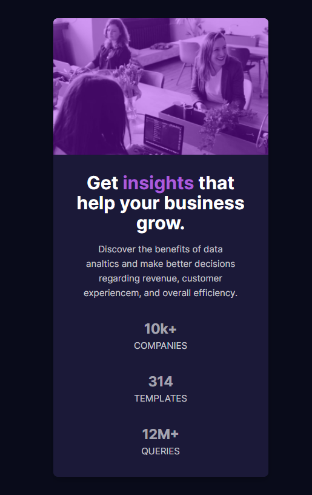

> Hello guys, I'm Arthur and I developed this web application from --
[Blogr landing page challenge on Frontend Mentor](https://www.frontendmentor.io/challenges/stats-preview-card-component-8JqbgoU62). Check out! ☕

- Summary
    - [Overview](#overview)
        - [The challenge](#the-challenge)
        - [Screenshots](#screenshots)
        - [Links](#links)
    - [My process](#my-process)
        - [Built with](#built-with)
        - [I learned](#what-i-learned)
        - [Useful resources](#useful-resources)
    - [Author](#author)

## Overview

### The challenge

Users should be able to:

- View the optimal layout for the site depending on their device's screen size ✅

### Screenshots

Here you can see the web page layout!

__Desktop__ 💻

__Mobile__ 📱

### Links

- Solution URL: [Website](https://arthurcotrim.github.io/stats_preview-card/)
- Live Site URL: [Live website](https://youtu.be/7D6YNwmWqMM)

## My process

### Built with

- Visual Studio Code
- Semantic HTML5
- CSS3
- Git 

### I learned

* How to make an image responsive to your parent

### Useful resources

[Stackoverflow](https://stackoverflow.com/) - It was helpful with css properties, how to manipulate in a better way the the images size.

## Author

## Author

Hey guys, I hope you all enjoy it and please contact me if you need something about the project! 🐱‍👤

- Frontend Mentor - [arthurcotrim](https://www.frontendmentor.io/profile/arthurcotrim)
- Github - [arthurcotrim](https://github.com/arthurcotrim)